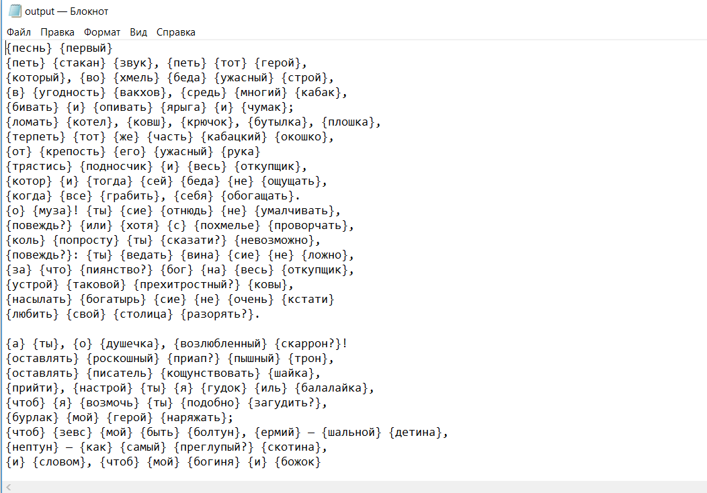
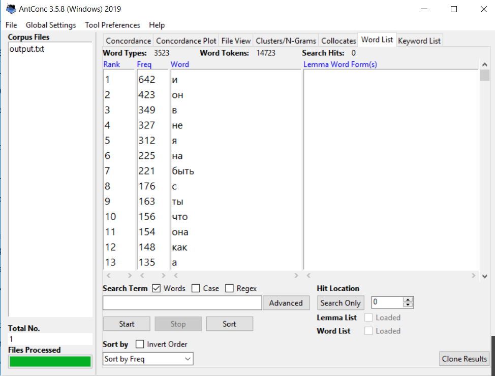
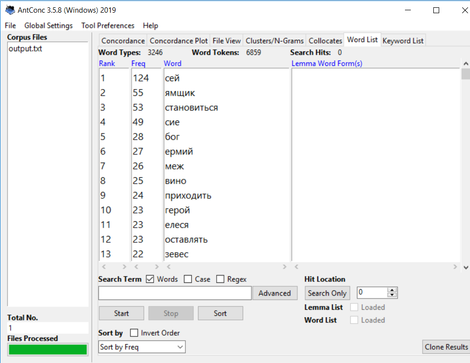
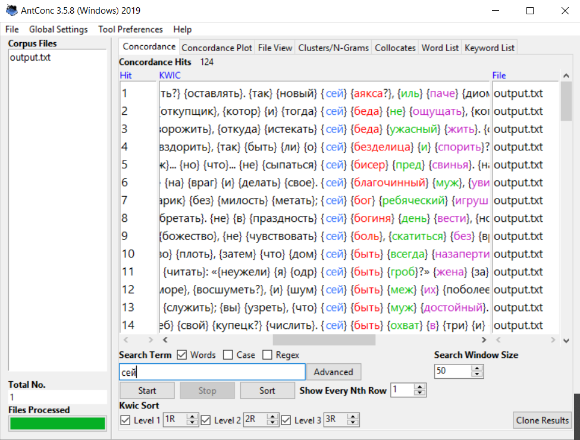
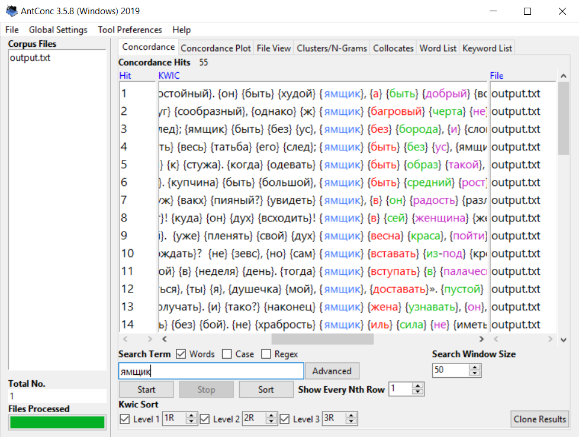
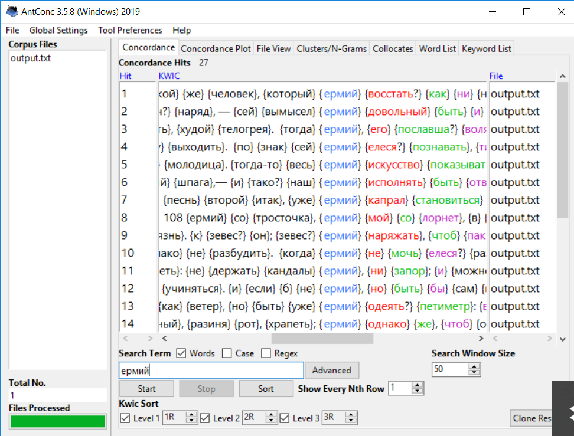
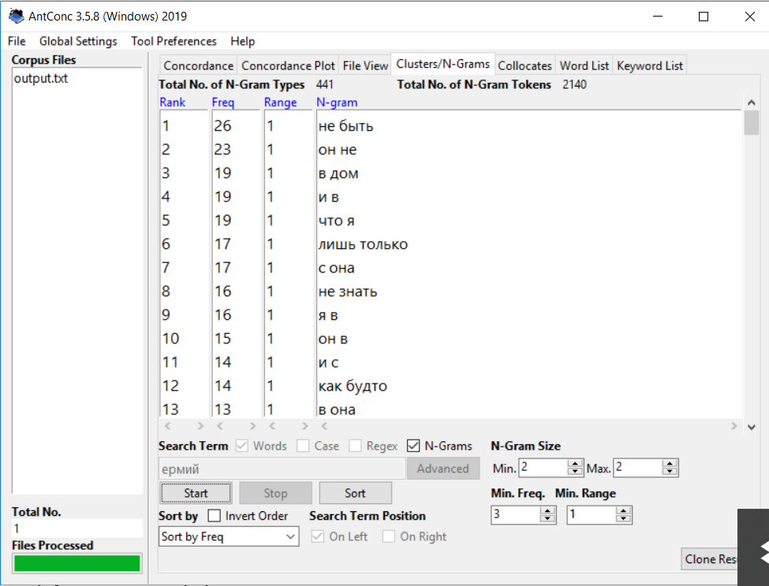
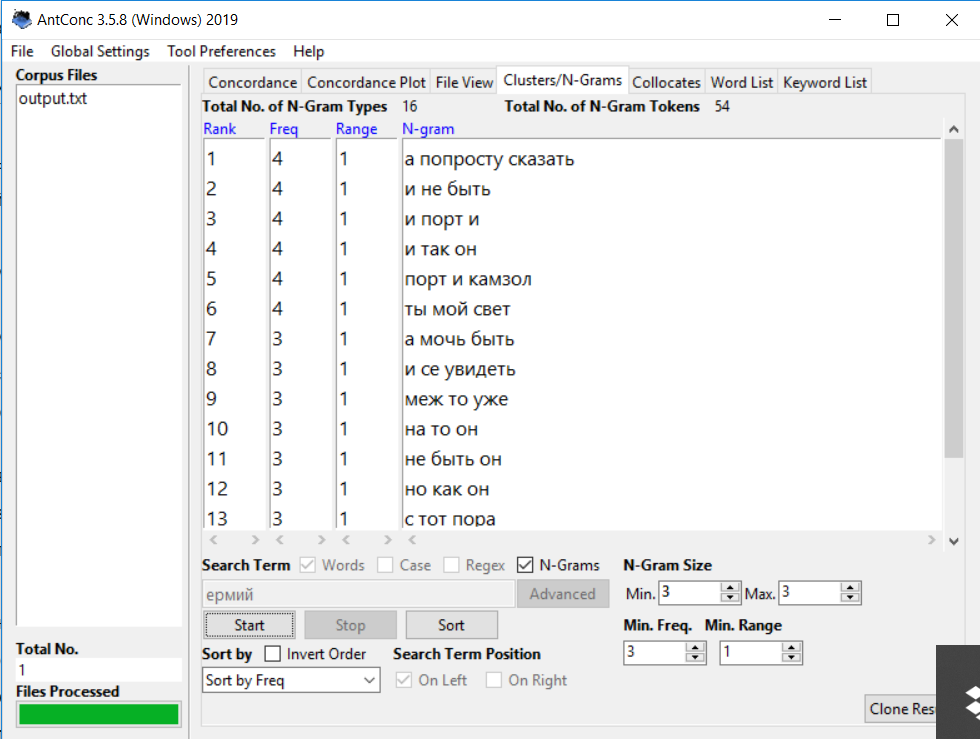
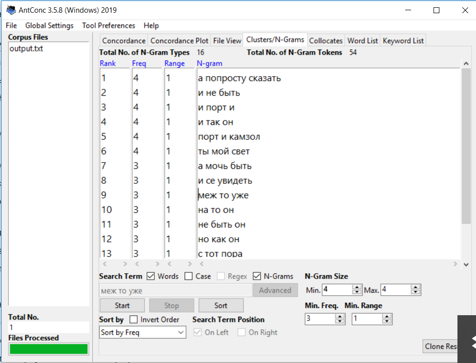
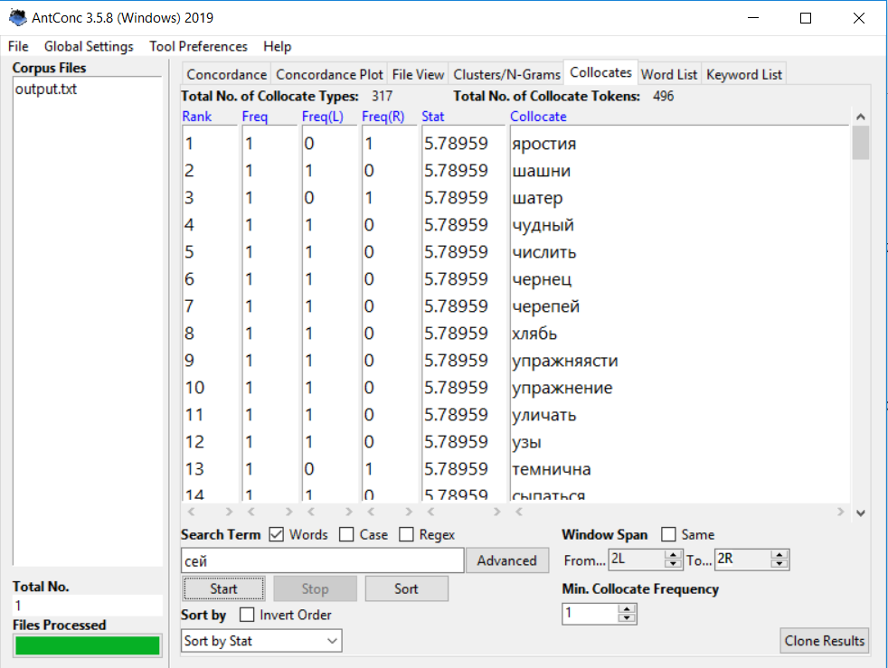

# HW3
1. Я лемматизировала свой текст:

2. Я посмотрела самые частотные слова 

3. Я посмотрела самые частотные слова без стоп-слов

4. Я посмотрела конкордансы трех устаревших слов:

 
5. Я построила частотный список двух-, трех- и четырехсловных словосочетаний

6. Я построила списки коллокатов слова "сей"

7. Устаревшие слова: 
Хлябь (ipm - 0,18) . Аналог - бездна (ipm - 5,38)
Стенать(ipm - 0,19). Аналог - плакать(ipm - 23,28)
Гайтан(ipm - 0,13). Аналог - тесьма (ipm - 0,25)
